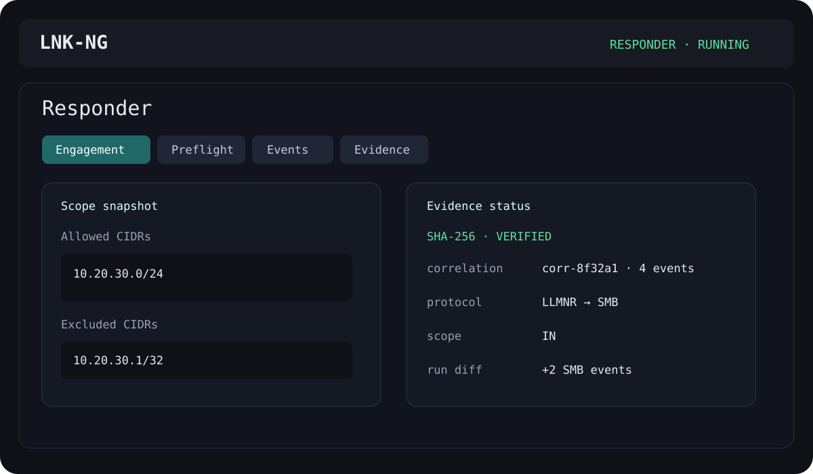

# LNK-NG

**LNK generation, static analysis, Responder Analyze-mode telemetry, and evidence handling in one desktop workbench.**

> For authorized security testing, lab validation, and defensive analysis. Responder execution remains Analyze-only (`-A`).

<p align="center"></p>

## What it does

LNK-NG keeps a deliberately small top-level UI: **LNK Builder** and **Responder**. Underneath that, Phase 4 adds correlation, integrity verification, run comparison, and stronger LNK static-analysis indicators without turning the project into a sprawling multi-window tool.

<p align="center"></p>

### LNK Builder

- Build NTLM/environment-style shortcut artifacts for controlled lab validation.
- Inspect existing Shell Link metadata with `win32com`, `pylnk3`, or a binary fallback parser.
- Extract UNC references and useful embedded strings.
- Calculate a static **risk score (0–100)** and surface indicators such as remote resource references, command interpreters, long argument strings, and target/workdir mismatches.

### Responder workbench

- One persistent `QProcess`; changing views does not spawn duplicate Responder instances.
- Analyze-only operation (`-A`).
- Preflight checks for executable/version/configuration, privileges, and listener conflicts.
- Read-only `Responder.conf` service-state matrix.
- Engagement CIDR allowlists/exclusions with `IN`, `OUT`, and `UNKNOWN` event tagging.
- Protocol-aware structured events with credential/hash-like material redacted before persistence.
- Phase 4 correlation IDs group repeated observations from the same source/name/protocol inside a time window.

### Evidence

Each completed run contains:

```text
runs/<run-id>/
├── manifest.json
├── events.jsonl
└── integrity.json
```

`integrity.json` records SHA-256 hashes and file sizes for the manifest and event stream. Verification detects later tampering. Evidence exports include all three files.

The evidence backend can also compare two runs and report deltas by protocol, event type, scope, and source—for example `SMB +3`, `OUT -2`, or a newly observed source.

## Event model

```text
timestamp
protocol
 event_type
source
identity / name
scope              IN | OUT | UNKNOWN
correlation_id
correlation_count
message            redacted source line
```

## Architecture

```text
MainWindow
├── LNK Builder
│   ├── Build
│   └── Inspect + risk indicators
│
└── Responder
    ├── Engagement
    ├── Preflight
    ├── Services
    ├── Events + correlation
    └── Evidence + integrity/diff/export

ResponderController
├── QProcess
├── EventCorrelator
└── RunStore
    ├── manifest.json
    ├── events.jsonl
    └── integrity.json
```

## Install

Linux / Kali:

```bash
python3 -m venv .venv
source .venv/bin/activate
pip install -e '.[linux,dev]'
lnk-ng
```

Windows:

```powershell
py -m venv .venv
.venv\Scripts\Activate.ps1
pip install -e ".[windows,dev]"
lnk-ng
```

Responder remains an external dependency.

## Tests and CI

```bash
pytest -q
ruff check lnkup tests
```

GitHub Actions covers Linux and Windows on Python 3.10, 3.12, and 3.13. Tags matching `v*` build wheel/sdist artifacts and publish a GitHub Release.

## Safety boundary

LNK-NG reads Responder configuration and runs Responder in Analyze mode. It does **not** mutate `Responder.conf`, enable poisoning switches, relay captured material, crack credentials, or automatically interact with observed hosts.

## Roadmap

Phase 5 candidates: signed/attested evidence bundles, protocol-specific detail panes, installer/application bundles, engagement templates, and captured runtime screenshots for the README.

## Provenance

LNK-NG is a refactored next-generation experiment inspired by `Plazmaz/LNKUp`, with a new architecture focused on visibility, reproducibility, and defensive analysis.
