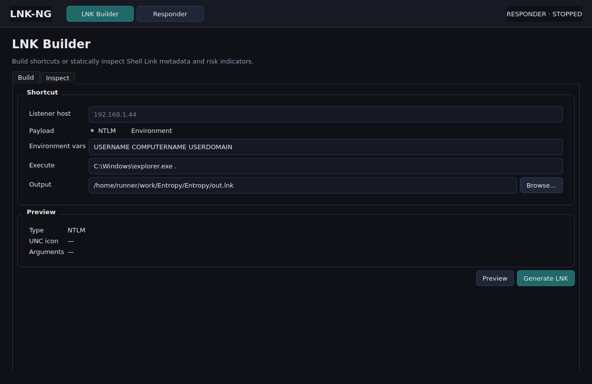
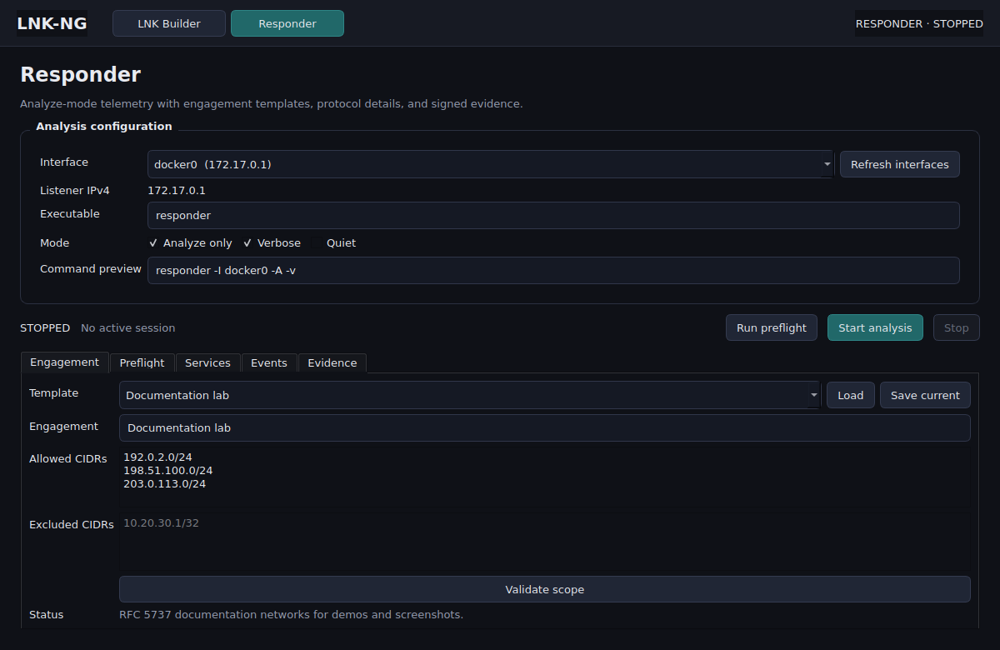
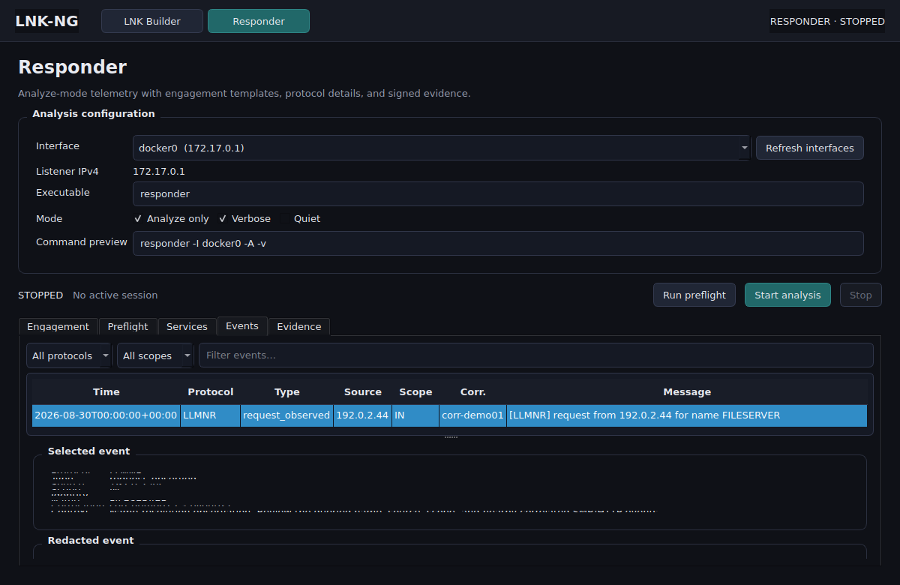
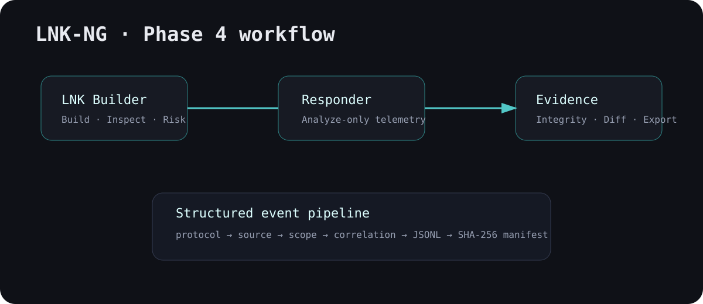

# LNK-NG

**Desktop LNK analysis + Responder Analyze-mode telemetry + verifiable evidence.**

> Built for authorized security testing, lab validation, and defensive analysis. Responder execution is intentionally restricted to Analyze mode (`-A`).

<p align="center">
  
  
</p>

The screenshots above are captured from the real PySide6 application in CI. The Responder screenshot uses the built-in RFC 5737 **Documentation lab** template rather than live target data.

## Highlights

### LNK Builder

- Build shortcut artifacts for controlled lab validation.
- Inspect Shell Link metadata with `win32com`, `pylnk3`, or a binary fallback parser.
- Extract UNC references and embedded strings.
- Calculate a bounded **0–100 static risk score**.
- Flag remote-resource references, command interpreters, unusually long arguments, and target/workdir mismatches.

### Responder workbench

- One persistent `QProcess`; changing views does not spawn duplicate Responder instances.
- Analyze-only execution (`-A`).
- Executable/version/configuration, privilege, and listener-conflict preflight checks.
- Read-only `Responder.conf` service-state matrix.
- Protocol-aware structured events with sensitive credential/hash-like material redacted before persistence.
- Engagement scope tagging: `IN`, `OUT`, or `UNKNOWN`.
- Time-window correlation across related observations.
- Protocol-specific detail panes for name-resolution, SMB, HTTP(S), DNS, and generic events.

<p align="center">
  
</p>

The protocol-detail screenshot is also generated from the application itself using safe synthetic `192.0.2.0/24` documentation-range telemetry.

## Engagement templates

Phase 5 adds reusable engagement profiles directly to the **Engagement** tab:

- **Unscoped analysis** — observations remain `UNKNOWN` unless scope is supplied.
- **Private lab** — RFC 1918 ranges as a starting point for isolated labs.
- **Documentation lab** — RFC 5737 networks for demos, screenshots, and documentation.
- **User templates** — saved locally under `~/.config/lnk-ng/engagements/`.

Exclusions take precedence over allowlists, and the scope snapshot is frozen for the lifetime of an active run.

## Evidence and attestation

Every completed run is self-contained:

```text
runs/<run-id>/
├── manifest.json
├── events.jsonl
├── integrity.json
└── attestation.json     # optional, created when a run is signed
```

`integrity.json` stores SHA-256 hashes and sizes for the evidence files. Phase 5 can then create an **Ed25519 attestation** over that integrity document. The evidence bundle carries the public key and detached signature in `attestation.json`; the private key stays outside the run directory and outside exported evidence.

Generate a signing key:

```bash
lnk-ng-attest keygen ~/keys/lnk-ng-signing.pem
```

Verify an attested run:

```bash
lnk-ng-attest verify runs/<run-id>
```

The Evidence tab also exposes **New signing key**, **Attest + export**, and **Verify attestation** actions.

## Evidence analysis

Stored runs can be browsed and exported from the UI. The backend supports run-to-run comparison across:

```text
protocol
 event_type
scope
source
```

Correlation metadata is persisted with each structured event:

```text
timestamp
protocol
event_type
source
identity / name
scope                 IN | OUT | UNKNOWN
correlation_id
correlation_count
message               redacted source line
```

## Architecture

<p align="center"></p>

```text
MainWindow
├── LNK Builder
│   ├── Build
│   └── Inspect + risk indicators
│
└── Responder
    ├── Engagement + templates
    ├── Preflight
    ├── Services
    ├── Events + protocol details + correlation
    └── Evidence + integrity + attestation + export

ResponderController
├── QProcess
├── EventCorrelator
└── RunStore
    ├── manifest.json
    ├── events.jsonl
    ├── integrity.json
    └── attestation.json (optional)
```

## Install from source

### Linux / Kali

```bash
python3 -m venv .venv
source .venv/bin/activate
pip install -e '.[linux,dev]'
lnk-ng
```

### Windows

```powershell
py -m venv .venv
.venv\Scripts\Activate.ps1
pip install -e ".[windows,dev]"
lnk-ng
```

Responder remains an external dependency and is not bundled with LNK-NG.

## Application bundles

Phase 5 adds a PyInstaller workflow for both **Linux** and **Windows**. It produces self-contained application directories as GitHub Actions artifacts, and tagged releases publish the generated bundle alongside the Python distribution artifacts.

These are application bundles rather than native `.deb` / `.msi` installers. Native installers can be layered on later without changing the application architecture.

To create release artifacts, push a version tag such as:

```bash
git tag v0.5.0
git push origin v0.5.0
```

## Tests, screenshots, and CI

```bash
pytest -q
ruff check lnkup tests
```

GitHub Actions covers Linux and Windows on Python 3.10, 3.12, and 3.13. A separate headless Qt workflow launches the actual application and refreshes the README screenshot assets reproducibly.

## Safety boundary

LNK-NG reads Responder configuration and starts Responder only in Analyze mode. It does **not** mutate `Responder.conf`, enable poisoning switches, automate relay behavior, crack credentials, or automatically interact with observed hosts.

## Provenance

LNK-NG is a refactored next-generation experiment inspired by `Plazmaz/LNKUp`, with a new architecture centered on visibility, reproducibility, defensive analysis, and evidence integrity.
